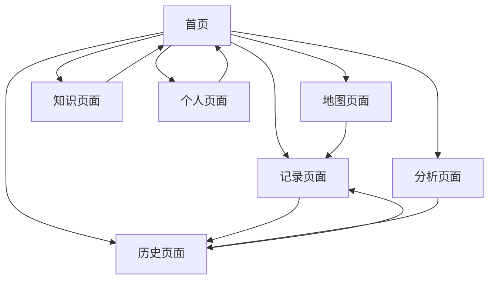

## 1. Product Overview
TodayDrunk（今日小酌）是一款专注于饮酒记录和酒文化分享的移动应用。用户可以记录每次饮酒体验，查看附近酒吧地图，学习酒类知识，并通过数据分析了解自己的饮酒习惯。
- 解决饮酒爱好者无法系统记录和分析饮酒体验的问题，为酒类爱好者提供专业的记录工具和知识平台。
- 目标成为酒类爱好者的首选记录和社交平台，培养理性饮酒文化。

## 2. Core Features

### 2.1 User Roles
由于是MVP版本，暂不区分用户角色，所有用户均可使用全部功能。

### 2.2 Feature Module
我们的TodayDrunk应用包含以下主要页面：
1. **首页**：应用导航、今日推荐、快速记录入口
2. **记录页面**：添加饮酒记录、选择酒类型、填写详细信息
3. **历史页面**：查看历史记录、日历视图、列表视图、筛选功能
4. **地图页面**：附近酒吧展示、地点详情、用户打卡
5. **知识页面**：酒类知识文章、基础知识、每日推荐
6. **分析页面**：饮酒数据统计、图表展示、趋势分析
7. **个人页面**：用户设置、成就系统、分享功能

### 2.3 Page Details

| Page Name | Module Name | Feature description |
|-----------|-------------|---------------------|
| 首页 | 导航模块 | 显示主要功能入口，包括记录、历史、地图、知识等快速访问按钮 |
| 首页 | 今日推荐 | 展示每日推荐酒款，包含酒类图片、名称、简介和详情链接 |
| 首页 | 快速记录 | 提供快速添加饮酒记录的入口，显示最近记录的酒类 |
| 记录页面 | 基本信息录入 | 选择日期（默认今天）、酒类型（啤酒、葡萄酒、白酒等7种类型）、品牌名称输入 |
| 记录页面 | 详细信息录入 | 填写酒精度（ABV）、容量（ml）、饮酒地点、心情备注 |
| 记录页面 | 照片上传 | 支持拍照或从相册选择酒瓶照片，可预览和删除 |
| 历史页面 | 日历视图 | 以日历形式展示有记录的日期，点击查看当日详情 |
| 历史页面 | 列表视图 | 按时间倒序显示所有饮酒记录，包含酒类型、品牌、日期等信息 |
| 历史页面 | 筛选功能 | 按酒类型、品牌、酒精度范围、日期范围进行筛选 |
| 地图页面 | 地图展示 | 显示附近酒吧、酒馆、酒类零售店的位置标记 |
| 地图页面 | 店铺信息 | 展示店铺名称、简介、开放时间、联系方式 |
| 地图页面 | 用户打卡 | 支持用户对到过的地点进行打卡和评价 |
| 知识页面 | 文章列表 | 展示酒类知识文章列表，包含标题、摘要、阅读量 |
| 知识页面 | 文章详情 | 显示完整的酒类知识内容，包含图片、文字说明 |
| 知识页面 | 分类浏览 | 按酒类型分类浏览相关知识文章 |
| 分析页面 | 统计概览 | 显示月饮酒次数、总量、平均ABV等关键数据 |
| 分析页面 | 图表展示 | 酒类偏好占比饼图、饮酒趋势折线图 |
| 分析页面 | 偏好分析 | 展示最常喝的品牌、最喜欢的酒类型、常去的地点 |
| 个人页面 | 成就系统 | 显示用户获得的成就徽章，如连续记录天数、尝试酒类数量等 |
| 个人页面 | 分享功能 | 将饮酒记录生成精美图片，支持分享到社交平台 |
| 个人页面 | 设置选项 | 应用设置、数据导出、隐私设置等功能 |

## 3. Core Process

用户主要操作流程：
1. 用户打开应用进入首页，可以查看今日推荐或快速添加记录
2. 点击记录功能进入记录页面，填写饮酒信息并保存
3. 通过历史页面查看过往记录，可切换日历或列表视图
4. 使用地图功能查找附近酒吧，进行打卡和评价
5. 浏览知识页面学习酒类相关知识
6. 在分析页面查看个人饮酒数据统计
7. 通过个人页面管理成就和分享记录

## 4. User Interface Design

### 4.1 Design Style
- **主色调**：深蓝色 (#1a365d) 和金色 (#d69e2e)，体现酒类的优雅和品质感
- **辅助色**：浅灰色 (#f7fafc) 背景，深灰色 (#2d3748) 文字
- **按钮样式**：圆角按钮，带有轻微阴影效果，点击时有渐变动画
- **字体**：中文使用苹方/思源黑体，英文使用 Roboto，主要字号 16px，标题 20px
- **布局风格**：卡片式设计，顶部导航栏，底部Tab导航
- **图标风格**：线性图标风格，配合酒杯、地图、书本等主题图标

### 4.2 Page Design Overview

| Page Name | Module Name | UI Elements |
|-----------|-------------|-------------|
| 首页 | 导航模块 | 顶部标题栏，4x2网格布局的功能卡片，每个卡片包含图标和文字标签 |
| 首页 | 今日推荐 | 横向滑动卡片，包含酒类图片、名称、简短描述，卡片阴影效果 |
| 记录页面 | 表单区域 | 垂直表单布局，输入框圆角设计，下拉选择器，日期选择器，照片上传区域 |
| 历史页面 | 视图切换 | 顶部Tab切换按钮（日历/列表），筛选按钮，搜索框 |
| 地图页面 | 地图容器 | 全屏地图视图，底部弹出式店铺信息卡片，浮动定位按钮 |
| 知识页面 | 文章列表 | 卡片式文章布局，包含缩略图、标题、摘要，分类标签 |
| 分析页面 | 图表区域 | 响应式图表组件，数据卡片展示，颜色渐变背景 |
| 个人页面 | 功能列表 | 列表式布局，每项包含图标、标题、箭头，成就徽章网格展示 |

### 4.3 Responsiveness
应用采用移动端优先设计，支持响应式布局适配不同屏幕尺寸，优化触摸交互体验，支持手势操作如滑动、点击、长按等。